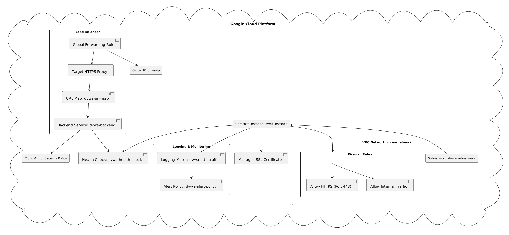

# Terraform Test DVWA Deployment Project in GCP

This project contains Terraform code for deploying a **Damn Vulnerable Web Application (DVWA)** with security measures, integrations, and scalability on **Google Cloud Platform (GCP)**.

## Network Segmentation:
Added a custom subnetwork (dvwa_subnetwork) to restrict IP ranges.
Introduced an internal firewall rule to allow only necessary internal communications.

## Instance Hardening:
Enabled ufw to block unnecessary traffic and configured fail2ban to protect against brute-force attacks.
Added unattended-upgrades to keep the system secure and up-to-date.

## Apache SSL Configuration:
Self-signed certificate configuration remains, but SSL-only access is ensured.
Configured TLS protocols and ciphers for security best practices.

## Cloud Armor:
Kept DDoS protection in place with adaptive protection.

## Logging and Monitoring:
Maintained logging and alert policies for proactive monitoring

## Features
- Deploys a DVWA instance with:
  - Custom network and firewall rules.
  - HTTPS load balancing.
  - Cloud Armor for DDoS protection.
  - Logging and monitoring integrations.

## Prerequisites
- Install [Terraform](https://www.terraform.io/downloads.html).
- GCP account with required permissions for resource creation.
- Enable GCP APIs:
  - Compute Engine
  - Cloud Logging
  - Cloud Monitoring
  - Cloud Armor

## Terraform Variables
You can configure the following variables in the `variables.tf` file:
| Variable           | Description                    | Default Value      |
|--------------------|--------------------------------|--------------------|
| `project_id`       | GCP Project ID                | `PROJECT_ID`         |
| `region`           | GCP Region for resources      | `us-central1`      |
| `zone`             | GCP Zone for the instance     | `us-central1-a`    |
| `domain_name`      | Domain for the HTTPS setup    | `yourdomain.com` |
| `source_ip_ranges` | IPs to block (e.g., attackers) | `["1.2.3.4"]` |

## Deployment Instructions
1. Clone this repository:
   ```bash
   git clone https://github.com/mferreirasec/dvwa-gcp.git
   cd dvwa-gcp


## Diagram


